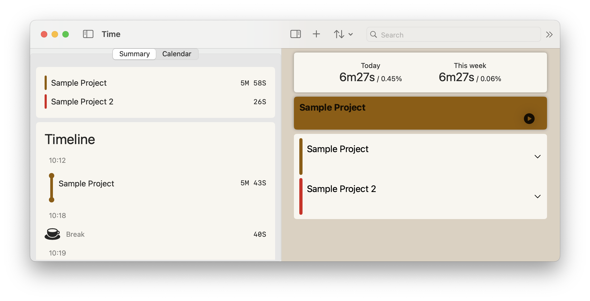
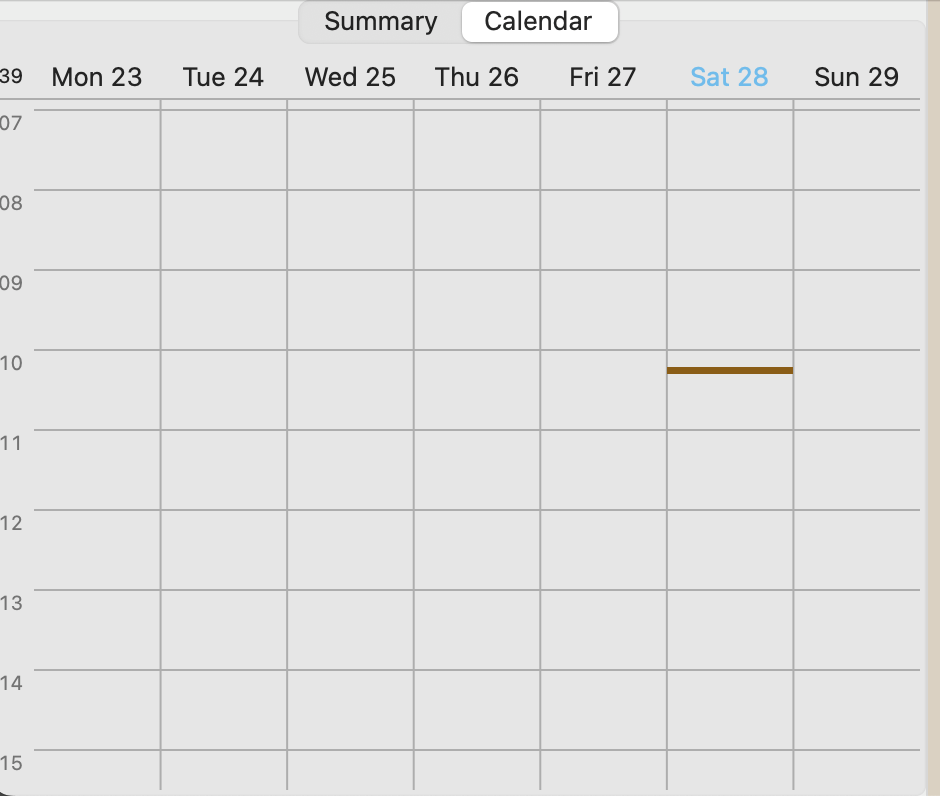
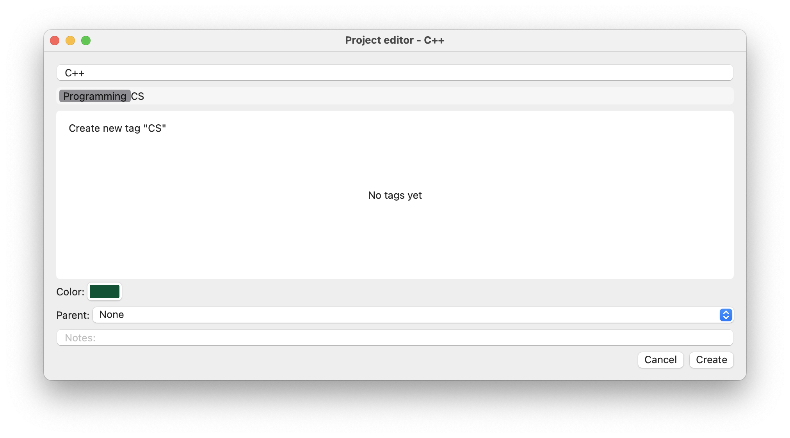

# About
A Time Logger for macOS.

**Warnings**

_This is a prototype app, so some of the buttons may not work as they are still a work in progress. 
I just find this 'app for practice' is not as simple as I believed._

Well... This is my first macOS app, so the main purpose is to familiarize myself with Apple's frameworks and learn the best practices by trial and error. I have to admit it has a lot of bugs, and the code is not consistent and does not follow the conventions.

# Features
- [x] Calendar view
- [x] Daily summary view
- [x] Project search
- [x] Backup

# Screenshots
The main UI:

The calendar view:

The creation view:
(I have to boast the tag selection view; it mimics the Finder's tag selection; it takes a lot of time to build)

